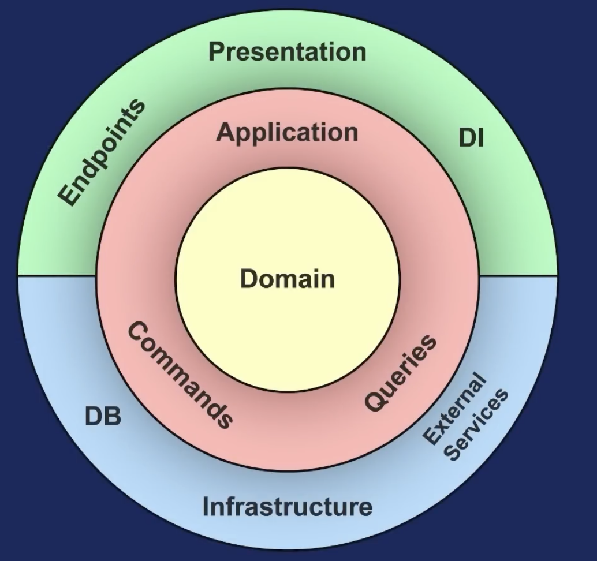
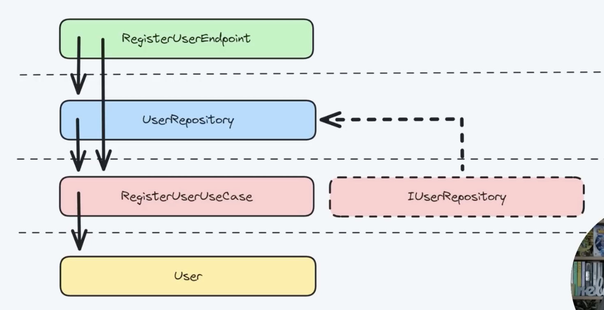

# Clean Architecture

- Domain Layer: Contains our system's entities (shouldn't have any references).
- Application Layer: Contains the use cases, the functionalities of our system (can reference the Domain layer).
- Presentation Layer: API endpoint to expose the use case to the outside world (can reference the Application and Domain layers).
- Infrastructure Layer: Contains the implementation of the abstractions in the levels bellow (talking to the DB, or any other external concerns). (can reference the Application and Domain layers)

Sometimes the Application and the Domain layers are in a single layer, representing the application core.
Sometimes the Infrastructure and the Presentation layers are in a single layer.

The dependency rule states that all of our source code dependencies should point inwards.

Clean Architecture produces a solution with many layers of abstraction, meaning many projects.